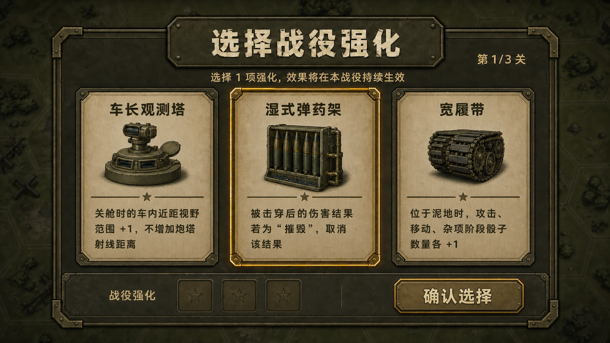
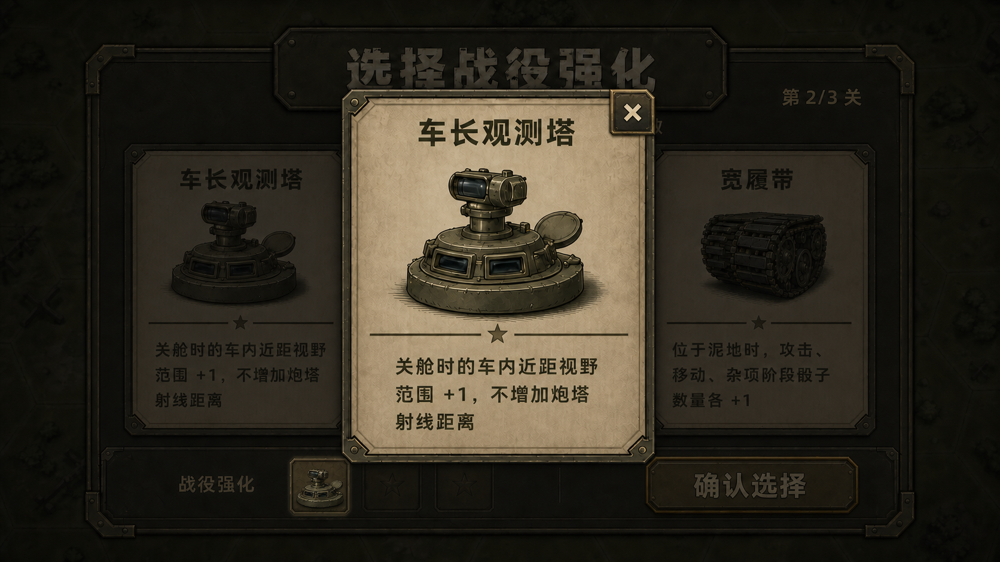
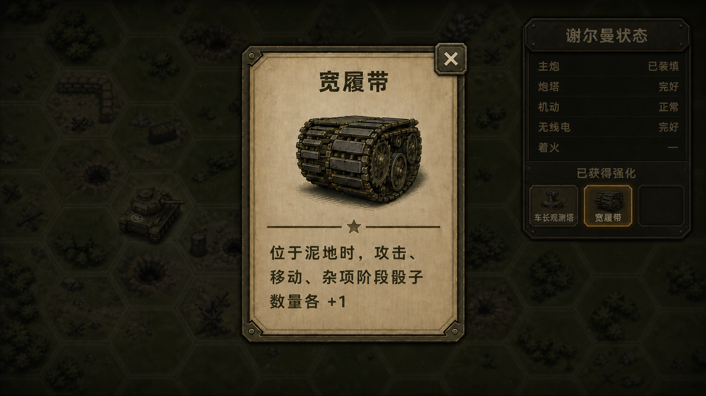

# 战役系统设计

日期：2026-07-09

## 目标

新增战役模式。每个战役由 3 个连续小关卡组成，玩家完成当前小关后，以指定的谢尔曼状态进入下一小关。现有欧洲战场、太平洋战场入口保持不变；新增“战役”页签，先用复制出来的太平洋关卡资源组成 4 个独立战役。

## 玩家可见行为

- 在“欧洲战场”“太平洋战场”页签后新增“战役”页签。
- “战役”页签初始提供 4 个战役：
  - 塔拉瓦红滩1：复制太平洋 01-03 关。
  - 塞班岛：复制太平洋 04-06 关。
  - 塔拉瓦红滩2：复制太平洋 07-09 关。
  - 贝里琉：复制太平洋 10-12 关。
- 原“太平洋战场”页签仍显示原来的 12 个太平洋关卡，玩家仍可选择任意指定关卡单独挑战。
- 只有 3 个小关全部完成后，战役才算胜利。
- 玩家在战役中任意小关失败后，重新挑战该战役时只能从第 1 小关开始，不提供中途复活点。
- 仅在硬核模式进入战役时，每个小关开始前先弹出强化选择界面；玩家必须从 3 个候选强化中选择 1 个，界面关闭后该小关才正式开始。
- 已选择的强化立即作用于当前小关，并在同一战役的后续小关中持续生效；每过一关再选择 1 个，因此 3 关战役最多累计 3 个强化。
- 经典模式战役、硬核模式单关、经典模式单关和 PVP 均不显示该界面，也不应用战役强化。

## 硬核战役强化

### 触发与流程

1. 进入硬核战役的第 1 小关时，在关卡设置完成、玩家获得操作权之前显示强化选择界面。
2. 进入第 2、3 小关时，在关间状态处理和镜头转场完成后、该小关正式开始之前再次显示。
3. 每次从尚未获得的强化池中随机抽取 3 个不同选项；同一批候选不重复，已获得的强化不再进入后续候选池。
4. 界面打开时默认选中中间卡片。玩家点击其它卡片只会切换当前选中项；点击右下角“确认选择”按钮后，才记录当前强化、关闭界面并开始当前小关。
5. 强化效果可累计，但首版同名强化不可重复获得。强化只修改玩家直接控制的主角坦克，不影响友军或敌军单位。
6. 战役胜利、失败、主动退出或重新开始后清空本次战役的全部强化。开始另一个战役时不得继承。

强化选择界面属于阻塞式关卡前流程。界面存在期间不推进回合、事件、AI、动画计时或玩家战斗输入。

### 三选一界面 UI

首版视觉稿：



#### 信息结构

界面为覆盖在战场上的全屏模态层，由背景遮罩、主面板、标题区、候选卡区和战役强化栏组成。

- **背景遮罩**：保留当前小关战场作为上下文，但覆盖约 75% 黑色 / 暗橄榄遮罩；地图、单位与 HUD 不可交互，不突出任何可行动信息。
- **主面板**：位于屏幕安全区中央，占横屏宽度约 84%、高度约 82%。沿用战斗界面的深橄榄填充、双层描边、角部短线与轻微投影，避免引入新的科幻或卡牌稀有度风格。
- **标题区**：主标题固定为“选择战役强化”；副标题固定为“选择 1 项强化，效果将在本战役持续生效”；右上显示当前进度“第 {current}/{total} 关”。
- **候选卡区**：3 张卡片等宽横排，视觉权重相同。每张卡从上到下依次显示强化名称、缩小后的装备图、分隔线和完整效果说明。说明区至少占卡片高度的 35%，默认容纳 3–4 行中文，不展示实现字段。
- **战役强化栏**：底部左侧显示“战役强化”和与战役总关数相同的槽位。已获得槽显示小图标与名称，并可点击打开强化详情；未获得槽显示暗色占位符且不可点击。
- **确认区**：底部右侧固定显示“确认选择”按钮。按钮用于获得当前选中强化并关闭界面；因为界面始终存在默认选中项，所以按钮打开时即可用。

#### 尺寸与排版

以 1920×1080 横屏设计基准为例：

| 元素 | 建议值 |
|---|---|
| 屏幕安全边距 | 左右 96 px，上下 54 px；刘海 / 圆角设备继续叠加系统安全区 |
| 主面板 | 1610×880 px 左右，水平和垂直居中 |
| 三卡间距 | 32 px |
| 单卡最小尺寸 | 440×570 px |
| 主标题字号 | 64–72 px，粗体 |
| 卡片名称字号 | 40–48 px，粗体，最多 1 行 |
| 装备图区域 | 不超过卡片内容高度的 38%，不得挤占说明区 |
| 效果说明区域 | 不少于卡片内容高度的 35%，建议容纳 3–4 行中文 |
| 效果说明字号 | 26–30 px，超长文本优先在下限字号内换行，不使用跑马灯 |
| 卡片触控区域 | 整张卡可点击，不小于卡片可见区域 |
| 确认选择按钮 | 建议不小于 320×96 px，右下对齐，触控区覆盖完整按钮 |

主面板随屏幕等比缩放，但文字字号设最小值。宽高比窄于 16:9 时优先压缩卡间距与装备图，不压缩卡名、效果说明或确认按钮；首版不切换为纵向列表，不支持竖屏。

#### 卡片状态

| 状态 | 表现 |
|---|---|
| 默认 | 米黄色卡面、深色文字、暗铜双层边框；三卡亮度一致 |
| 按下 | 卡片整体下移 4 px，装备图与卡面亮度略提高；播放一次轻触反馈 |
| 已选中 | 暖黄铜双层边框并轻微上浮；界面首次打开时默认由中间卡片进入此状态，同一时刻只能有 1 张卡选中 |
| 已确认 | 点击“确认选择”后，选中卡保持黄铜高亮，另外两张卡与按钮停止响应；短暂显示 0.25 秒后关闭界面 |
| 已获得槽 | 在底栏填入该强化的小图标和名称，使用按钮态边框；点击后打开该强化的详情界面 |

桌面调试环境可以让鼠标悬停复用“按下”高亮，但移动端不依赖悬停态。

#### 交互规则

1. 面板进入时，背景遮罩在 0.15 秒内淡入，主面板以 0.2 秒轻微上移并淡入；入场动画完成前卡片不接受输入。
2. 入场完成后默认选中中间卡片，“确认选择”按钮处于可用状态。
3. 点击左、中、右任意卡片只切换当前选中项，不获得强化、不关闭界面；重复点击已选中的卡片不改变状态。
4. 点击“确认选择”后立即锁定三张卡片和按钮输入，把当前选中强化写入运行态并刷新底栏。
5. 已确认卡片播放 0.25 秒高亮反馈，然后界面淡出并开始关卡。不再弹出二次确认框。
6. 点击已获得强化槽会在当前选择界面之上打开强化详情；关闭详情后返回原选择状态，不改变当前选中的候选强化。
7. 点击选择界面的遮罩、标题、空槽或系统返回键均不能关闭选择界面；不提供关闭、跳过或刷新候选按钮。
8. 若强化图加载失败，卡片仍显示名称与完整效果并保持可选择；不得因为单张插图缺失阻塞关卡。

#### 强化详情界面

选择界面内的详情状态视觉稿：



强化详情是选择界面和战斗界面共用的二级模态层，只用于查看，不执行获得、替换或移除强化。

- **内容**：固定显示强化名字、完整图标和完整效果描述。内容数据与三选一卡片读取同一个强化定义，不维护第二份文案。
- **组件复用**：详情主体复用选择界面的强化卡片内容组件，隐藏选中边框、按下态和候选点击逻辑；允许按详情尺寸放大卡片，但名称、图标、分隔线和说明区结构保持一致。
- **尺寸**：以 1920×1080 为基准，建议宽 620–720 px、高 680–780 px；说明区至少容纳 4 行中文，超出时只在说明区内竖向滚动，标题和图标保持固定。
- **背景层**：详情打开后，在当前界面之上再覆盖约 65% 黑色遮罩。底层选择界面或战斗 HUD 保持可辨识，但全部停止响应。
- **关闭方式**：点击详情右上角“×”或点击详情卡片以外的遮罩区域关闭。点击卡片内部、图标、名称或描述不关闭。
- **关闭热区**：“×”可见尺寸建议 56×56 px，实际触控区域不小于 88×88 px；详情外部的全部遮罩均是关闭热区。
- **关闭结果**：只销毁详情层与二级遮罩，返回打开详情前的界面和状态；不改变已获得强化、当前候选选择、回合状态或滚动位置以外的任何运行态。
- **层级**：强化详情高于选择面板、谢尔曼状态面板和普通战斗 HUD，低于系统级断线、报错或强制确认弹窗。同一时间只能打开 1 个强化详情。

#### 战斗界面的已获得强化

战斗界面状态稿：



仅在硬核战役中，战斗界面的“谢尔曼状态”面板增加“已获得强化”区：

- 位于车辆状态行之后、面板底部，横向显示本次战役已经获得的强化槽；最多 3 个，与战役累计上限一致。
- 每个已获得槽显示 128×128 px 规范图标的缩略版和短名称，整格可点击；没有获得强化的槽使用暗色占位符且不可点击。
- 点击已获得槽后打开与选择界面完全相同的强化详情组件，显示名字、图标和完整效果描述。
- 强化区不得挤压状态名称和状态值的最小字号。空间不足时优先向下扩展状态面板，再缩短各状态行的垂直间距；不隐藏既有车辆或乘员状态。
- 经典模式、硬核单关、PVP 和不具备战役强化的战斗不显示“已获得强化”区。
- 详情打开期间，战斗地图、谢尔曼状态面板、阶段按钮和其它 HUD 均停止接受输入，回合、AI、事件和计时不推进。关闭详情后从原状态继续。
- 若打开详情时已有其它普通模态层，则先关闭或拒绝打开强化详情，避免两个普通模态层叠加；强化选择界面是唯一允许作为详情底层的例外。

#### 强化插图规范

- 每个强化使用一张居中的单色或低饱和装备插图，保持二战美军维修手册 / 装备图鉴风格。
- 插图以深灰、橄榄绿和黄铜为主，不使用紫 / 蓝 / 金等稀有度分色；所有强化在视觉上等权。
- 图形应在 128×128 px 缩略尺寸下仍能区分。强化名称和效果文字才是信息真值，插图不承担唯一识别职责。
- 10 个图形主题分别为：车长塔 / 潜望镜、瞄准镜、弹药架、防崩落内衬、灭火器、侧裙板、宽履带、变速箱、烟幕发射器、车内通话器。

### 首版强化池

| 名称 | 效果 |
|---|---|
| 车长观测塔 | 车内视野 +1。这里的车内视野指硬核模式下关舱时由车体提供的近距视野范围；不额外增加炮塔朝向射线的长度。 |
| 改进瞄准镜 | 炮手视野 +1；主炮攻击的命中所需点数 -1。炮手视野指炮塔当前朝向提供的观察 / 主炮射线距离。命中修正与精确射击等既有修正叠加。 |
| 湿式弹药架 | 主角坦克被击穿后，若伤害结果为“摧毁”，取消该结果，坦克不被摧毁；本次伤害检定不重掷，也不顺延执行其它伤害结果。 |
| 防崩落衬层 | 主角坦克被击穿后，若伤害结果为“乘员阵亡”，取消该结果；不重掷，也不顺延执行下一个可执行的伤害结果。其它来源的乘员阵亡不受影响。 |
| 自动灭火器 | 杂项阶段中，所有原本具有修复功能的骰子 / 动作同时增加“灭火”选项；选择后按既有灭火规则结算并消耗该骰。 |
| 裙板 | 前侧装甲、后侧装甲各 +1；只修改这两个受击面，不影响前装甲与后装甲。 |
| 宽履带 | 主角坦克位于泥地时，攻击、移动、杂项阶段的骰子数量各 +1；该加成在阶段骰数钳制前与其它加成合并。 |
| 改进变速箱 | 所有原本执行“前进”的玩家行动骰，都可以改为执行“转向”；原“前进”选项保留，转向合法性和消耗沿用既有规则。 |
| 烟幕发射器 | 杂项阶段的 2、4 点增加“烟雾弹”功能；杂项 3 点的既有烟雾弹无需强化、初始即可使用。目标、持续时间、数量限制和行动消耗沿用既有规则。 |
| 车内通话器 | 杂项阶段骰子数量 +1；该加成在阶段骰数钳制前与其它加成合并。 |

### 作用顺序

- 视野、装甲和阶段骰数量强化先修改对应基础计算，再进入既有地形、乘员、状态、射程和上下限规则。
- “改进瞄准镜”的命中所需点数 -1 作为命中阈值修正，与精确射击的 -2 等修正相加，最终仍沿用既有命中阈值边界。
- “湿式弹药架”和“防崩落衬层”只拦截被击穿后的指定伤害结果，不影响命中、击穿、命中骰对子、着火检定、狙击手、斯图卡或其它独立规则，除非那些规则最终明确走到被拦截的伤害结果。
- 多个不同强化同时生效时分别结算；若同一次受击同时产生多个彼此独立的结果，只取消强化明确覆盖的结果。

## 方案

采用方案 A：预拼接战役地图，加分段激活。

战斗场景加载战役定义后，继续加载 3 个复制出来的小关任务资源，把 3 张地图拼接成一张大地图，并记录当前激活的小关段。只有当前激活段会生成单位、结算任务目标、触发回合结束事件。未来小关段只提供可见地形，单位和事件在谢尔曼进入该段前不存在。

这样可以保留旧单关流程，同时在 BattleScene 外围增加战役运行层，负责关卡加载、目标包装、绘制、阴影和关间转场。

## 数据模型

在 `LevelDB` 中新增战役入口类型：

- `entryKind: 'mission'` 保持现有单关入口行为。
- `entryKind: 'campaign'` 表示战役入口。
- 战役进度使用独立章节 id，例如 `campaign`，避免与欧洲或太平洋关卡编号冲突。

新增战役定义资源，例如：

```text
assets/resources/campaigns/pacific_campaigns.json
```

每个战役定义包含：

- 稳定的战役 id。
- 标题本地化 key。
- 3 个复制出来的小关任务资源路径。
- 地图拼接方向，首版固定为横向拼接。
- 可选镜头转场时长，默认约 2 秒。

把现有太平洋任务 JSON 复制到战役专用目录，例如：

```text
assets/resources/missions/campaign_pacific/campaign_tarawa_red_beach_1_01.json
assets/resources/missions/campaign_pacific/campaign_tarawa_red_beach_1_02.json
assets/resources/missions/campaign_pacific/campaign_tarawa_red_beach_1_03.json
```

复制出的任务资源是战役小关配置的来源。原 `mission_pacific_01..12` 资源不为战役差异做修改。内部资源名可以使用 ASCII slug；玩家可见名称必须使用本设计中的中文战役名。

## 运行态

`GameSession` 在 `selectMission` 旁新增战役选择路径，记录：

- 当前战役 id。
- 当前战役资源路径。
- 当前战役入口编号。
- 是否从存档恢复；首版新开战役固定为 false。

`BattleScene` 在战役模式下维护战役运行态：

- 当前激活小关索引。
- 3 个小关定义和已加载的 `MissionData`。
- 每个小关拼接到大地图后的坐标偏移。
- 当前激活小关的目标和回合事件表 id。
- 每个小关的边界，用于绘制、阴影和镜头居中。
- 本次战役已获得的强化 id 列表。
- 当前小关的 3 个候选强化 id，以及强化选择界面是否已完成确认。

非战役模式下，现有单关加载和战斗行为保持不变。

## 地图拼接

3 个小关按战役顺序横向拼接。每个小关的 offset 坐标会转换到同一个大地图坐标系中。

首版实现规则：

- 保留每个复制小关原有行列布局和地形定义。
- 第 2 小关放在第 1 小关东侧，第 3 小关放在第 2 小关东侧。
- 当前小关的撤离边和下一小关入口需要形成足够清楚的边界衔接，使“驶离当前小关”自然进入下一小关起始格。
- 使用当前小关目标中的 `evacAt` 和 `evacExitDir` 判断是否触发进入下一段。

谢尔曼从第 1 小关配置的起始格开始。进入下一小关时，谢尔曼出现在下一小关配置的起始格；连续性通过“从当前出口进入下一入口”的关间转场表达，而不是复用越界后的临时坐标。

## 分段激活

战役加载时：

- 第 0 段为当前激活段。
- 第 1、2 段地形已经存在于拼接后的地图里。
- 第 1、2 段单位不生成。
- 只有第 0 段目标和回合事件表生效。

当前激活段通过撤离完成时：

1. 如果后面还有小关，拦截普通胜利面板。
2. 应用关间谢尔曼状态规则。
3. 当前激活段索引加 1。
4. 从复制任务数据中初始化新小关的友军和敌军。
5. 切换目标、事件表和任务元信息到新小关。
6. 重新计算新激活段的可见范围。
7. 用约 2 秒把镜头平移到新小关地图中心。
8. 按现有战斗流程开始下一段的玩家回合或阶段。

只有第 3 段完成时，才标记战役完成并显示最终胜利。

## 关间谢尔曼状态

进入下一小关时保留：

- 乘员存活状态。
- 当前车体朝向和炮塔朝向，前提是方向值仍有效。
- 主炮装填状态。
- 舱盖开闭状态。

进入下一小关前清除：

- 着火等级。
- 瘫痪状态。
- 炮塔受损状态。
- 无线电受损状态。
- 烟雾状态。

进入下一小关后重新计算：

- 视野范围，使用下一小关开局配置和单位默认值。

这样战役连续性主要体现在车组和车辆操作状态上，同时把关间可以整备的临时损伤清除，避免上一关的着火、瘫痪等状态直接锁死后续小关。

## 迷雾与战役阴影

战役阴影独立于战争迷雾。

- 普通战争迷雾仍由 `FogOfWar.ts` 和当前游戏模式控制。
- 未来小关地形即使未激活也可见。
- 未来小关地形额外覆盖一层战役阴影，亮度比普通迷雾更低。
- 未来小关单位不绘制，因为它们尚未生成。
- 已完成小关的地形仍保留可见，但不再拥有激活目标或事件。

绘制顺序应保证战役阴影位于地形之上、激活单位表现之下。普通迷雾仍只按当前激活段的规则应用。

## 镜头转场

小关切换时复用现有地图平移层，不新增独立摄像机系统。

转场目标是下一小关拼接边界的中心点。地图视图从当前平移位置插值到目标位置，时长约 2 秒。转场期间阻止玩家输入。转场结束后恢复标准操作，并开始下一小关。

## 目标与胜负

`Objective.checkOutcome` 仍可作为单小关目标判断器。BattleScene 在战役模式下包装胜利处理：

- `defeat` 仍然立即判定为战役失败。
- 第 0、1 段的 `victory` 转换为“进入下一小关”。
- 第 2 段的 `victory` 才转换为最终战役胜利。

战役完成后，`MenuProgress` 标记战役入口完成。单独挑战原太平洋关卡时，仍只标记原太平洋关卡进度。

## 回合结束事件

只有当前激活段的事件表会绑定到运行时事件 provider。未来小关的事件表在该小关激活前完全忽略。

小关切换时：

- 销毁当前回合结束事件 UI。
- 清理未完成的回合结束事件运行态。
- 创建或切换到新小关 `eventTableId` 对应的事件 provider。
- 重置每段专用的事件序列状态。

## 存档与继续

首版不新增战役中途保存和继续功能。玩家从菜单开始战役时，总是从第 0 段开始。现有单关战斗存档路径不应被复用于战役中途检查点，除非后续另行设计显式的战役存档结构。

主菜单现有“继续游戏”按钮保持当前单关行为。

## 本地化

新增语言 key：

- 战役章节标题和副标题。
- 4 个战役按钮标题。
- 可选的转场战报文本，例如“推进至下一阶段”。
- 强化选择界面的标题、副标题、关卡进度、“战役强化”和“确认选择”。
- 10 个强化的名称与完整效果描述；选择卡、已获得槽、详情界面和谢尔曼状态面板必须共用同一组 key。
- 强化详情关闭按钮的无障碍名称，例如“关闭强化详情”。

可见战役或关卡标题不应包含桌游剧本标签，例如 `Scenario A1:`。

## 测试与验证

重点检查：

- 战役定义映射到 4 个入口和 12 个复制小关资源。
- 原太平洋 `LevelDB` 入口仍指向原 `mission_pacific_*` 路径。
- 战役进度使用 `campaign` 章节 id，不会标记太平洋单关完成。
- 谢尔曼关间状态按确认规则保留、清除和重新计算。
- 只有当前激活段单位会被初始化。
- 前两段胜利进入下一段，而不是结束战斗。
- 第三段胜利才标记最终战役胜利。
- 只有“硬核模式 + 战役入口”会在每个小关开始前显示三选一强化界面。
- 强化候选同批不重复、排除本次战役已获得项，且未确认前不会开始关卡或接受战斗输入。
- 第 1、2、3 小关选择的强化分别对当前关及后续小关生效，效果按规则正确累计。
- 经典战役、经典 / 硬核单关与 PVP 不应用任何战役强化。
- 战役胜利、失败、退出、重开或切换到其它战役时，强化运行态会被清空。
- 10 个首版强化分别覆盖视野、命中、伤害结果拦截、灭火、装甲、泥地骰、前进转向、烟雾弹和杂项骰规则，并与既有规则按确认顺序叠加。
- 选择界面和战斗中的已获得强化槽均可点击，并打开同一个强化详情组件。
- 强化详情正确显示名称、图标和完整描述；点击“×”或卡片外遮罩关闭，点击卡片内部不关闭。
- 从选择界面关闭详情后保留原候选选中项；从战斗界面关闭详情后保留原回合、阶段、骰子和 HUD 状态。
- 详情打开期间底层选择界面或战斗界面不响应输入；战斗中的回合、AI、事件和计时不推进。
- 经典模式、硬核单关与 PVP 的谢尔曼状态面板不显示战役强化区。

实际验证：

- 对编辑过的脚本运行有针对性的 TypeScript 或 `node --check` 类检查。
- 对纯 helper 代码尽量增加聚焦运行探针。
- 运行 `git diff --check`。

整仓 `tsc --noEmit` 不作为主要验证信号，因为当前 Cocos 工程已知存在 TypeScript 噪声。

## 不在首版范围内

- 多人/PVP 战役模式。
- 战役中途保存和继续。
- 分支战役。
- 除本设计明确列出的硬核战役三选一强化及已确认关间谢尔曼状态规则之外的奖励、维修、补给系统。
- 重做或修改原太平洋单关资源。
